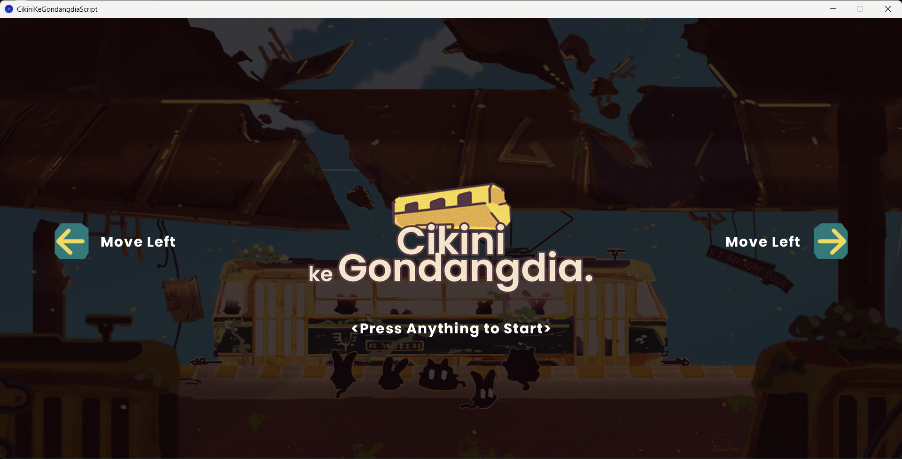
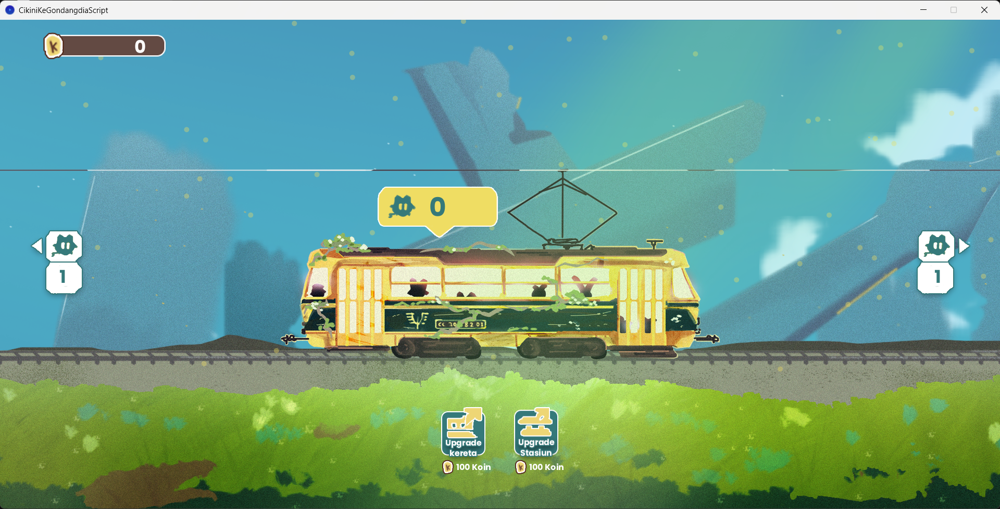
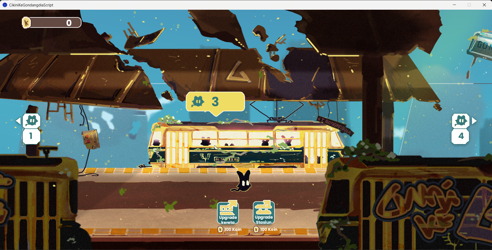
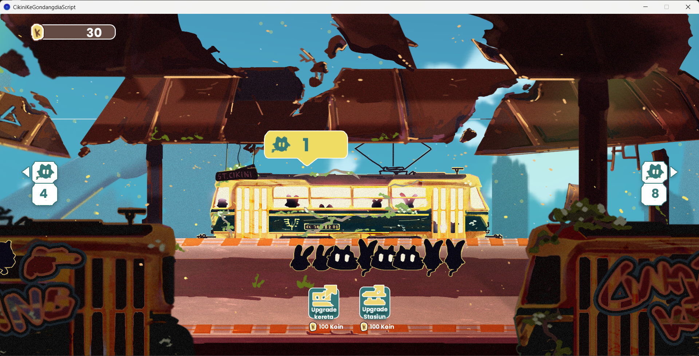

# 🚆🐾 Cikini ke Gondangdia 🐾🚆

## Overview
🎮✨ “Cikini ke Gondangdia” is a casual game that combines train driving simulation with parallax scrolling visuals. Players are tasked with delivering passengers in the form of cats 🐱 from Cikini Station to Gondangdia Station. With a cheerful feel and dynamic visual effects, this game presents a colorful and fun train driving experience. Each trip awards points that can be used to increase train and station capacity, creating a simple management challenge. 🎮✨

## 🛠️ How To Install
1. Download and install [Processing](https://processing.org/download/).
2. Download or clone this repository.
3. Make sure all asset folders (`Asset/`, `Character/`, `UI/`, and audio files) are in the same directory as the `.pde` file.
4. Open `CikiniKeGondangdiaScript.pde` in Processing.
5. Click the **Run** button. ▶️

## 🎲 How To Play
- **Start the Game:** Press any key or click the mouse to begin. 🖱️
- **Move the Train:**  
  - Press the **LEFT** arrow key ⬅️ to move the train to Gondangdia (left).
  - Press the **RIGHT** arrow key ➡️ to move the train to Cikini (right).
- **Upgrade:**  
  - Click the **Upgrade Train** button 🚄 to increase train capacity (costs 100 coins 🪙).
  - Click the **Upgrade Station** button 🏢 to increase station capacity (costs 100 coins 🪙).

## ⚙️ Mechanics
- **Passenger Spawning:** Cats 🐈 randomly appear at both stations.
- **Boarding:**  
  - At each station, cats board the train if there is space.
  - Cats from the opposite station will disembark and earn you coins 🪙.
- **Points:** Earn coins for every cat successfully transported.
- **Upgrades:** Use coins to upgrade your train and stations for higher capacity.
- **Visuals:** Enjoy parallax scrolling backgrounds and animated fireflies 🐞.
- **Sound:** Includes background music 🎵 and sound effects for actions like boarding and upgrades.

## 🎥 Gameplay Video

## 💻 Technology Used
- [Processing](https://processing.org/) (Java-based creative coding framework)
- [Minim](http://code.compartmental.net/tools/minim/) (audio library for Processing)
- Custom graphics and sound assets

## 📸 Screenshot

**Splash Screen**

**Environment**

**Cikini Station**

**Gondangdia Station**

## 📄 License
This project is licensed under the MIT License. See [LICENSE](LICENSE) for details.

## 🙏 Credits
- **Rifki Setiawan** – 👨‍💻 Game Programmer  ([GitHub](https://github.com/rifkisetiawan0101))   
- **Khalfani Abrar** – 🎨 2D Character & Environment Illustrator, UI/UX Designer ([GitHub](https://github.com/mukafug))   
- **Yoseph Satria Praka** – 🔬 R&D ([Instagram](https://www.instagram.com/yyoooosz/))

🚋 Thanks for playing! 🚋
